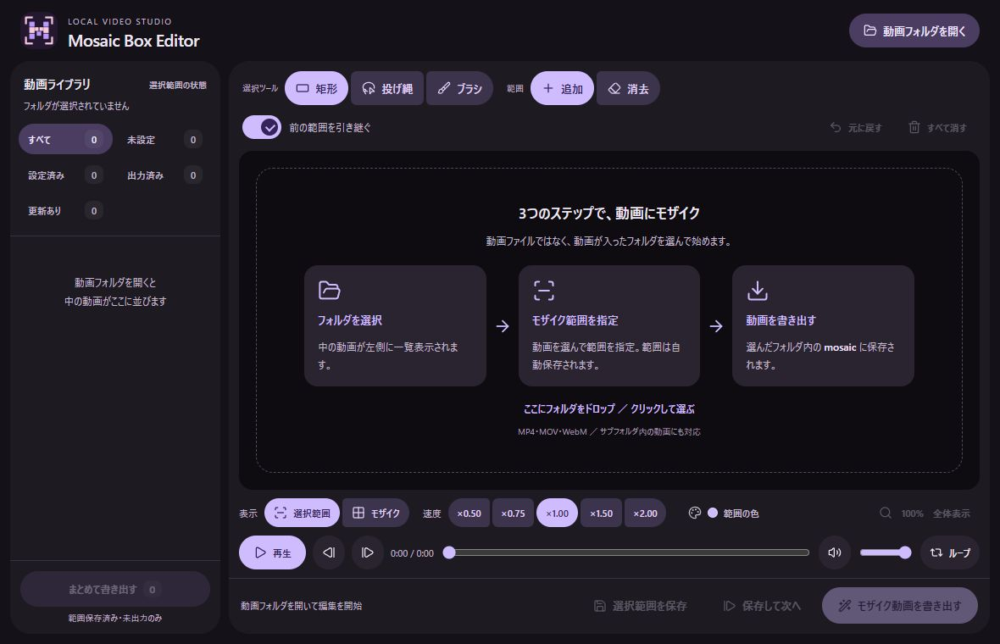

# Mosaic Box Editor

ローカル動画にモザイクを付ける、Windows向けのデスクトップアプリです。
動画フォルダを開き、矩形・投げ縄・ブラシで範囲を指定して書き出せます。
動画をサーバーにアップロードする処理はありません。



## ダウンロード

[Releases](https://github.com/SantaSunrise/mosaic-box-editor-exe/releases) から
`Mosaic-Box-Editor-v0.0.2-windows-x64.zip` をダウンロードし、**ZIP全体を展開**して
`mosaic-box-editor.exe` を開いてください。

- 対象: Windows 10 / 11、x64。
- ffmpeg・ffprobeは同梱済みです。インストールやPATH設定は不要です。
- 表示には [Microsoft Edge WebView2 Runtime](https://developer.microsoft.com/microsoft-edge/webview2/) を使用します。未導入のPCではインストールしてください。
- 移動するときは、`bin`・`licenses` を含むフォルダ全体を移動してください。
- 署名なしのポータブル版です。インストーラー・自動更新は含みません。

## 使い方

1. **動画が入ったフォルダを選ぶ**  
   「動画フォルダを開く」を押すか、空の編集画面にフォルダをドロップします。
   MP4・MOV・WebMがサブフォルダも含めて左側に並びます。
2. **モザイク範囲を指定する**  
   動画を選び、矩形・投げ縄・ブラシで範囲を追加・消去します。範囲は自動保存されます。
   「前の範囲を引き継ぐ」を有効にすると、未設定の動画に直前の範囲をコピーできます。
3. **動画を書き出す**  
   「モザイク動画を書き出す」で、選んだフォルダ内の `mosaic` にMP4を保存します。
   「まとめて書き出す」は、範囲が保存済みで、出力ファイルがまだない動画が対象です。

```text
選んだフォルダ/
├── clip.mp4                 元動画（変更しません）
├── scene/another.mov
├── boxes/                   選択範囲のJSON（自動保存）
│   ├── clip.json
│   └── scene/another.json
└── mosaic/                  モザイク済みMP4
    ├── clip.mp4
    └── scene/another.mp4
```

| 一覧の状態 | 意味                                         |
| ---------- | -------------------------------------------- |
| 未設定     | 保存された範囲がありません                   |
| 設定済み   | 範囲は保存済みで、まだ出力していません       |
| 出力済み   | モザイク動画を書き出しています               |
| 更新あり   | 元動画または範囲が、出力後に更新されています |

「更新あり」は一括書き出しに含めません。動画を開いて個別に再出力してください。
個別の書き出しでは、同じ保存先の出力を置き換えます。

## 編集操作

- ループ再生は、裏で先頭を準備したプレイヤーへ交代して、先頭へのシーク待ちを減らします。ループONの間だけ2つ目の動画を読み込みます。

- 選択範囲／モザイクのプレビュー切り替え。
- 再生速度: ×0.50 / ×0.75 / ×1.00 / ×1.50 / ×2.00（プレビューのみ）。
- ホイールでマウス位置を中心に拡大縮小。中ボタンドラッグで移動。「全体表示」でリセット。
- 範囲表示は5色、濃さは3段階。表示設定は書き出すモザイクには影響しません。
- ブラシの太さ調整中は、中央の円で画面上の大きさを確認できます。

| キー        | 操作                               |
| ----------- | ---------------------------------- |
| Space       | 再生／一時停止                     |
| R / L / B   | 矩形／投げ縄／ブラシ               |
| A / E       | 範囲の追加／消去                   |
| M           | 選択範囲／モザイク表示             |
| Ctrl+S      | 範囲を保存                         |
| Ctrl+Z      | 直前の範囲操作を戻す               |
| ← / →       | 約1フレーム戻る／進む（30fps換算） |
| Shift+← / → | 約1秒戻る／進む                    |

## 制限

- ループ時は追加のメモリ・デコーダーを使用します。先読みが間に合わない場合は通常の先頭シークに戻ります。動画や再生環境によって、映像・音声のつなぎ目が完全になくなるとは限りません。

- 範囲は動画全体に共通です。対象の自動追跡・キーフレーム編集はありません。
- 書き出しはH.264 / AACのMP4です。利用可能なGPUエンコーダーを順番に試し、利用できなければCPUに切り替えます。
- プレビューの対応コーデックはWebView2に依存します。拡張子が対応していても再生できない動画があります。
- 一括書き出しの中止は、処理中の1本が終わってから反映されます。
- 同じサブフォルダに拡張子だけが異なる同名動画を置くと保存先が重なります。元動画の名前を分けてください。

## 開発

このリポジトリはTauri版のみを管理します。旧ブラウザ版やPythonツールは含みません。

必要な環境:

- Windows x64、PowerShell 7、Node.js 22.18以上、pnpm 11.25.0。
- Rust stable（MSVC）、Visual Studio Build Toolsの「C++によるデスクトップ開発」。
- WebView2 Runtime。初回の依存関係とFFmpeg取得時はインターネット接続が必要です。

```powershell
pnpm install --frozen-lockfile
pnpm setup:ffmpeg
pnpm tauri dev
```

`setup:ffmpeg` は固定バージョンのアーカイブと実行ファイルのSHA256を照合します。
大きな実行ファイルはGitに含めず、配布ZIPに同梱します。
`pnpm dev` は画面だけの確認用です。フォルダ操作・保存・書き出しには `pnpm tauri dev` を使います。

```powershell
pnpm check
pnpm test
pnpm format:check
cargo fmt --manifest-path src-tauri/Cargo.toml --check
cargo clippy --manifest-path src-tauri/Cargo.toml --all-targets -- -D warnings
cargo test --manifest-path src-tauri/Cargo.toml --lib -- --include-ignored
```

```powershell
pnpm tauri build --no-bundle
pnpm package:portable
```

配布物は `release/` に生成されます。[開発ガイド](CONTRIBUTING.md) と
[リリース手順](docs/releasing.md) も参照してください。

## 構成

| 場所                                 | 担当                                     |
| ------------------------------------ | ---------------------------------------- |
| `src/main.ts`                        | 編集状態・イベント・Tauri呼び出し        |
| `src/ui/`                            | 画面テンプレート・アイコン               |
| `src/renderer.ts`                    | 範囲・モザイクのプレビュー描画           |
| `src/viewport.ts`                    | ズーム・パンの座標計算                   |
| `src/batch-export.ts`                | 一括書き出しの順次実行・中止・エラー集計 |
| `src/types.ts` / `src/appearance.ts` | 共通のデータ型・表示設定                 |
| `src-tauri/src/project.rs`           | 一覧・範囲の保存と削除                   |
| `src-tauri/src/mask.rs`              | 書き出し用のマスク生成                   |
| `src-tauri/src/media.rs`             | FFmpegの解決・動画情報取得・書き出し     |
| `tools/`                             | テスト・FFmpeg取得・配布物作成           |

## ライセンス

アプリ本体は [MIT](LICENSE) です。
同梱FFmpegはGyanの9.0.1 full static build（GPLv3）で、独立したプロセスとして呼び出します。
第三者コンポーネントにはそれぞれのライセンスが適用されます。
配布物の `licenses/` と [第三者ライセンス情報](THIRD_PARTY_NOTICES.md) を参照してください。
